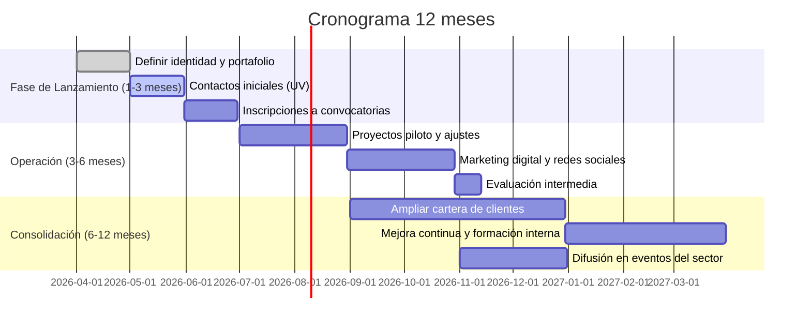

# Plan integral para la creación del colectivo (comunicaciones científicas)

## Recursos iniciales  
- **Equipo humano:** 2 profesionales con amplia experiencia en divulgación científica. Ventaja clave: conocimiento de contenido técnico y redes académicas.  
- **Equipos y materiales:** Dos portátiles (Asus A15, MacBook M2), 2 PCs de escritorio, cámara réflex Nikon D5300 con flash básico y lentes, iPad Pro. Este hardware permite producción multimedia interna (foto, video, diseño).  
- **Financiamiento:** Presupuesto muy limitado (sin capital inicial externo). Se operará con bajo costo: casa/espacio compartido (sin alquiler), herramientas gratuitas/open source (p.ej. Figma, Canva, GIMP). Los gastos iniciales mínimos facilitan comenzar rápidamente, pero deberán controlarse cuidadosamente.  

## Mensaje central y diferenciación  
El colectivo promueve que **la divulgación científica sea atractiva y accesible**, no aburrida ni rígida. La comunicación debe ser **transmedia**: combinando gráficos, video, web y redes. De acuerdo con VO Comunicación, comunicar ciencia implica “transformar información compleja en mensajes claros, visuales y atractivos”【60†L29-L32】, lo que coincide con nuestro enfoque didáctico y creativo. Esto nos diferencia de agencias genéricas: nuestro mensaje es que la ciencia se cuenta de forma dinámica, estimulando la curiosidad. Se resaltará este diferencial en todos los materiales promocionales (slogan, branding, redes sociales).

## Objetivos de crecimiento a 1 año  
- **Credibilidad y cartera de clientes:** Conseguir testimonios y casos de éxito iniciales para atraer nuevos clientes. Meta: 5–10 clientes recurrentes de investigación u ONG.  
- **Posicionamiento local:** Ser reconocidos en Cali como colectivo confiable. Apostar por alianzas con medios locales de ciencia y participar en eventos del sector.  
- **Expansión de oferta:** Evaluar incorporar colaboradores o formadores en comunicación científica para ampliar capacidad.  
- **Indicadores clave:** Número de proyectos realizados, satisfacción del cliente, visibilidad en redes y eventos (por ejemplo, charlas en UV). El éxito se medirá en reputación (boca a boca) y facturación sostenible básica. Dado el nicho, el crecimiento será orgánico; se estima duplicar la clientela inicial hacia el año, más que crecimientos exponenciales. No obstante, el impulso de políticas de CTeI en Cali (p.ej. nueva Política Pública de CTI) indica un escenario favorable a mediano plazo.

## Alianzas estratégicas  
- **Universidad del Valle (UV):** Punto de partida natural: allí nos conocen. Contactar grupos de investigación, departamento de comunicaciones y editoriales universitarias. Ofrecer talleres o colaboraciones que aprovechen nuestra experiencia.  
- **Instituciones locales de ciencia y cultura:** INCIVA (Instituto de Valle), museos, planetarios; revistas científicas locales (mencionan convocatoria de INCIVA 2026 para divulgación). Establecer puentes con eventos de ciencia (ferias, congresos) y medios académicos.  
- **Colectivos y freelances:** Aunque no hay alianza formal, se puede colaborar con diseñadores freelancers o grupos afines (p. ej. “La Isla en Vela” en arte y educación) para proyectos multidisciplinares.  
- **Alianzas tecnológicas:** Participar en redes de emprendimiento de Cali (p.ej. Ruta N, hubs de innovación) para encontrar oportunidades conjuntas con startups interesadas en divulgación.

## Investigación de mercado regional  
- **Demanda laboral:** Según portales de empleo, hay numerosas ofertas de diseño en Cali (36 en Cali, 48 en Valle【68†L126-L134】). Esto refleja actividad en el sector creativo local. Aunque nuestro enfoque es de nicho (comunicación científica), indica que empresas y organizaciones contratan servicios de diseño gráfico/multimedia.  
- **Iniciativas públicas:** El gobierno local impulsa ciencia y tecnología. Por ejemplo, la Alcaldía de Cali adoptó una Política Pública de CTeI (Acuerdo 0565 de 2023), lo que podría traducirse en más proyectos de divulgación vinculados al desarrollo regional. A nivel nacional, Minciencias lanza convocatorias millonarias (Convocatoria Colombia Inteligente 2026: $24.000M COP【72†L118-L124】), aunque el colectivo no compite directamente, sí sugiere interés institucional en difusión de innovación.  
- **Competencia:** Existen agencias de diseño y comunicaciones generales (p.ej. Cuantika Studio, que ofrece “visualización de datos” e “infografías”【38†L37-L40】), pero pocas especializadas en comunicación científica. Esto nos da ventaja de especialización, aunque la competencia general (agencias creativas, freelance) puede competir en precios.  
- **Rentabilidad:** Con costos mínimos (cero renta, equipos propios), el riesgo financiero inicial es bajo. El desafío es generar ingresos suficientes para sustentar 2 personas. Dado el mercado local (universidades, laboratorios, ONGs), es viable si se asegura un flujo constante de pequeños proyectos. Una estrategia de bajo costo (uso de herramientas gratuitas【23†L166-L169】 y reinversión de ingresos) favorecerá la rentabilidad. En resumen, la prospección indica un mercado pequeño pero creciente en Cali para comunicación científica, donde nuestra propuesta de valor (experiencia y enfoque transmedia) es favorable.

## Servicios y entregables  
Basándonos en ambos planes y en la demanda local, se ofrecerán:  
- **Infografías científicas y visualizaciones de datos:** gráficas claras para reportes y redes.  
- **Animaciones y videos explicativos:** cortos 2D/3D sobre temas de investigación.  
- **Micrositios web para proyectos:** páginas independientes alojadas en la web principal, con diseño propio (como aconsejan microsites corporativos【17†L33-L36】).  
- **Libros digitales interactivos y reportes:** PDFs enriquecidos con multimedia, adaptados a dispositivos móviles y tabletas.  
- **Kits de contenido visual para redes:** plantillas de posts, banners, portadas de video.  
- **Consultoría en comunicación científica:** asesoramiento para estructurar mensajes de investigación (ofrecido como servicio de valor agregado).  
Comparado con otros estudios, esta oferta mezcla diseño editorial, multimedia e interacción (Cuantika cubre muchos de estos aspectos【38†L37-L40】). El plan incluye flexibilidad: si algún servicio no demanda, se ajusta el foco a los más solicitados.

## Roles y estructura operacional  
- **Diseñadora gráfica:** responsable de identidad visual, diseño de infografías, diagramación de documentos, materiales impresos/digitales estáticos.  
- **Diseñador multimedia/web:** encargado de animaciones, desarrollo de micrositios (usando Wordpress o similar gratuito), edición de video/fotografía y soluciones web interactivas (p.ej. presentaciones online).  
Ambos colaboran en la conceptualización de proyectos y el contacto con clientes. Adicionalmente, se definirán roles administrativos mínimos (facturación, contabilidad sencilla). Dado el tamaño, no habrá empleados fijos adicionales inicialmente.

## Plan operativo detallado  
1. **Preparación inicial (0-1 mes):**  
   - Definir nombre y branding (logo, paleta de colores, tono de comunicación).  
   - Crear portafolio demostrativo con 3–5 proyectos ficticios (p.ej. infografías sobre temas locales, maquetas de web de proyecto, video corto).  
   - Montar sitio web sencillo (usar plantillas) y perfiles en redes (LinkedIn, Instagram, Facebook) con identidad definida.  
   - Establecer precios base y paquetes (ver Modelo de negocio).  
   - Redactar presentaciones y plantillas de oferta.  

2. **Captación inicial (1-3 meses):**  
   - Contactar conocidos en UV: profesores, centros de investigación e innovación. Ofrecer pilotos sin costo o a precio reducido a cambio de testimonios.  
   - Asistir a eventos locales de ciencia (foros universitarios, ferias tecnológicas) para networking.  
   - Lanzar campañas en redes, enfocando mensaje de divulgación amena. Publicar muestras de trabajo.  
   - Registrar actividades en plataforma de gestión (p.ej. Trello) para seguimiento de tareas.  

3. **Operación y ajuste (3-6 meses):**  
   - Realizar los primeros proyectos (p.ej. infografía para un grupo de investigación, micrositio para una iniciativa cultural). Obtener feedback y mejorar procesos.  
   - Consolidar precios según horas reales invertidas. Aplicar fórmula sugerida: *(costos fijos mensuales + remuneración deseada) / 160 horas*【29†L134-L142】. Ejemplo: si se desea $3M COP/mes entre ambos y costos operativos $1M, tarifa base ≈ $25.000 COP/h. Luego definir paquetes (e.g. “Infografía básica” a 20h, “Paquete multimedia” a 50h).  
   - Buscar convocatorias locales de apoyo (incubadoras, fondos municipales) y nacionales (Minciencias) para proyectos asociativos.  
   - Evaluar entrada en plataformas freelance profesionales (Workana, Upwork) para ampliar cartera remota si hay capacidad.  

4. **Consolidación (6-12 meses):**  
   - Refinar servicios según demanda (por ejemplo, expandir a e-learning, podcasts si hay interés).  
   - Formular propuesta de valor para alianzas a largo plazo (universidad, centros culturales).  
   - Medir resultados: cantidad de clientes recurrentes, ingresos mensuales promedio (meta inicial cubrir costos básicos).  
   - Ajustar plan comercial si es necesario (ampliar prospectos, buscar fondos de innovación abierta, etc.).  

## Marketing y prospección  
- **Estrategia de mensajería:** Personalizar cada contacto. Evitar presentaciones genéricas: centrarse en problema del cliente (p.ej. “Noté que su grupo comparte avances pero sin apoyo gráfico; ¿cómo lo comunican?”). Usar CTA suaves como “¿Le parece útil una breve llamada de 10 minutos para explorar esta idea?”【42†L163-L169】.  
- **Canales:** Email directo y LinkedIn (conexiones a académicos y gestores culturales). Crear contenido de valor en redes: infografías gratuitas relacionadas con ciencia local (atraer seguidores). Colaborar con blogs de ciencia o medios universitarios.  
- **Seguimiento:** Cronograma estricto: enviar recordatorios tras 1 semana si no hay respuesta. Registrar respuestas y actualizaciones (CRM simple o hoja de cálculo).  
- **Plantillas:** Preparar modelos de email y LinkedIn: saludo personalizado, breve introducción del colectivo (mensaje central), referencia a un proyecto relevante del receptor, invitación a contacto (ver “Ejemplos” abajo). Evitar lenguaje de venta agresiva.  

**Ejemplo de mensaje email/LinkedIn:**  
“Estimado/a Dr/a. [Nombre], me llamó la atención su proyecto sobre [tema]. Creemos que su investigación merece difusión creativa: somos [Colectivo XYZ], especialistas en ilustrar ciencia de modo dinámico【60†L29-L32】. ¿Le interesaría una breve charla de 10 min para explorar cómo podríamos apoyar su difusión con infografías o videos? Saludos cordiales.”  

## Modelo de negocio y precios  
- **Tarifa por hora:** Calcular con fórmula indicada【29†L134-L142】. Esto cubre salario y costos. Por ejemplo, si entre ambos buscan $4M COP/mes y calculan 320h, el mínimo sería ~$12.500 COP/hora. En la práctica, se suelen cobrar tarifas más altas (por experiencia), por lo que puede redondearse hacia arriba ($25–50k COP/h).  
- **Paquetes de servicio:** Ofrecer categorías: básico (visión general, revisiones limitadas), estándar (más entregables), premium (consultoría + varios formatos). P.ej., “Paquete Web” incluye micrositio de 3 páginas + gestión de dominio por 2 meses, “Paquete Infográfico + Video”. Precios referenciales según horas estimadas.  
- **Negociación:** Citar precios no redondos y justificar valor (años de experiencia). Para reducir percepciones de riesgo, puede ofrecerse una pequeña muestra gratuita o revisar parte del trabajo sin costo (estrategia de prospección).  

## Cronograma integrado  

## Checklist operativo final  
- [ ] Definir nombre y registro (si aplica).  
- [ ] Crear logo, sitio web y redes sociales con la identidad visual.  
- [ ] Establecer tarifas base y paquetes de servicios.  
- [ ] Preparar portafolio con ejemplos de trabajos (infografía, video, web).  
- [ ] Elaborar documentos de presentación y plantillas de mensajes de prospección.  
- [ ] Contactar primeros prospectos en UV (y otros conocidos).  
- [ ] Registrarse en plataformas de freelancing profesionales.  
- [ ] Seguir convocatorias de apoyo regional/nacional (Minciencias, alcaldía).  

**Conclusión:** Aun con recursos limitados, el **equipo especializado** y el **mensaje diferenciador** (divulgación amena y transmedia) ofrecen ventaja competitiva. Con un plan operativo riguroso (uso de herramientas gratuitas【23†L166-L169】, enfoque en calidad y boca a boca) es posible construir una base de clientes en Cali. El mercado local muestra demanda por diseño multimedia【68†L126-L134】, apoyada por políticas de ciencia regionales. La viabilidad dependerá de mantener bajos los costos fijos, fijar precios adecuados y aprovechar alianzas iniciales con la universidad y organizaciones locales.  

**Fuentes:** Se consultaron portales especializados (por ejemplo, ofertas laborales en diseño en Cali【68†L126-L134】) y recursos de mejores prácticas (fórmula de precios【29†L134-L142】, estrategia de prospección【42†L163-L169】, comunicación científica efectiva【60†L29-L32】) para fundamentar este plan.